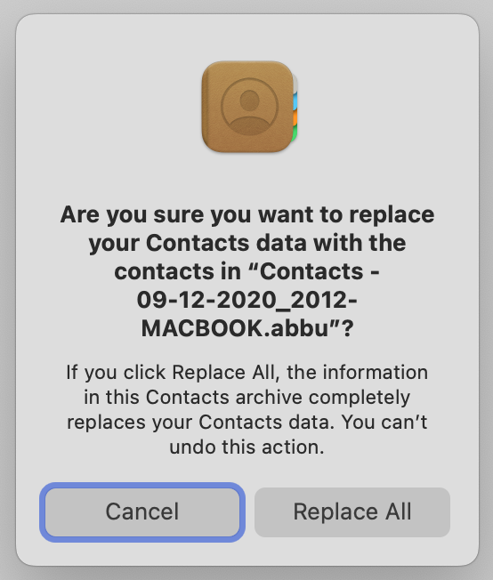

# Mac Address Book ABBU file to JSON

- Justin Pearson
- Nov 22, 2022

This python script converts a Apple "Contacts Archive" (eg, `My Contacts.abbu`) into a nice JSON format.
It also extracts images stored in the .abbu file.

# Motivation

In Apple's "Contacts" app, File > Export lets you export your contacts as a nice readable vCard format (`.vcf`) or as a strange "Contacts Archive" (`.abbu`) file format. The .vcf file doesn't contain images, so you'll lose the pictures of each contact. In contrast, the .abbu file contains the images (right click, "Show Package Contents", find "Images" directory), but there's no way to view the abbu file in Contacts App without wiping out your existing contacts!:

```
Are you sure you want to replace your Contacts data
with the contacts in "Contacts - 2012-MACBOOK.abbu"?

If you click Replace All, the information in this Contacts archive
completely replaces your Contacts data. You can’t undo this action.
```



[Searching Apple StackExchange](https://apple.stackexchange.com/search?q=abbu+file) shows that lots of folks have this problem:

- Annoyingly, a [common solution](https://apple.stackexchange.com/a/49172/145895) has you enable iCloud, upload your current contacts, disable your network connection, then import the abbu file (thereby wiping out your contacts) to view it or export it, then reverse the process to recover your "real" contacts from iCloud. Ugh! Maybe that works, but enabling iCloud has privacy issues, and also it seems risky to depend on iCloud's file-sync logic.

- [Another solution](https://apple.stackexchange.com/questions/30544/is-a-partial-restore-from-an-address-book-abbu-file-possible) has you create a guest account on your Mac and import the Contacts there. That solution didn't work for me: Contacts claimed to import it, but no contacts appeared in the app. [One commenter](https://apple.stackexchange.com/questions/30544/is-a-partial-restore-from-an-address-book-abbu-file-possible#comment135098_30545) with the same issue blamed this on Apple changing the .abbu file format between MacOS Lion and Mavericks.

- [The best solution](https://apple.stackexchange.com/a/209942/145895) uses a SQLite database browser to view the SQLite db `AddressBook-v22.abcddb` contained in the .abbu file (right click, "Show Package Contents"). This solution gives a short SQL query to extract some basic contact info from the abbu file. But you lose the contact images.

I wrote this Python program that extends ^-- that solution:

- It queries the SQLite db to get the contact info, automatically finding and joining relevant tables.
- It copies the images out of various Images/ directories, giving them appropriate file extensions.
- It renames the images to include the names of the contacts, not just the UIDs.


# Usage

Put a .abbu file in the `in/` directory and run this script.
This script parses the contacts and images in the .abbu file,
and creates 3 kinds of outputs in the `out/` directory:

1. `contacts.json` contains the contacts, formatted nicely:
   ```
      {
          "uid": "C13384AC-D081-4190-B5CB-DAEEE889A64D",
          "organization": "Apple Inc.",
          "phone": [
              [
                  "Main",
                  "1-800-MY-APPLE"
              ],
              [
                  "Office",
                  "123-123-1234"
              ]
          ],
          "url": [
              [
                  "HomePage",
                  "http://www.apple.com"
              ]
          ],
          "address": [
              [
                  "Work",
                  {
                      "street": "1 Infinite Loop",
                      "city": "Cupertino",
                      "state": "CA",
                      "zip": "95014",
                      "country": "United States",
                      "country code": "us"
                  }
              ]
          ],
          "ims": [
              {
                  "path": "/foo/in/My-Contacts.abbu/Images/C13384AC-D081-4190-B5CB-DAEEE889A64D",
                  "info": "TIFF image data, big-endian, direntries=14, height=320, bps=6, compression=none, PhotometricIntepretation=RGB, orientation=upper-left, width=320\n",
                  "image type": "tiff",
                  "base name": "C13384AC-D081-4190-B5CB-DAEEE889A64D",
                  "dst": "/foo/out/ims/Apple-Inc__C13384AC-D081-4190-B5CB-DAEEE889A64D.tiff"
              }
          ]
      }, ...
      ```
  - Note: the email / address / url / phone fields may have multiple "types", eg, home, work, etc.
  - Note: I preserve the UID in case you need it, like for matching up images with contacts.
  - Note: This json format supports the case where 1 contact has multiple images in the .abbu file. I don't know why an .abbu file has multiple images for some contacts, but it does.

2. The `ims/` directory contains copies of images that were found in the abbu file.
   To make the image filenames easier to use, I prepend the first name, last name, and organization.
   Also I add a file extension.

3. The `ims/orphans/` directory contains copies of images that were found in the abbu file,
   but whose filenames (UIDs) don't map to any UID of any contact.


# Details

An Mac Address Book `.abbu` file is a directory containing 3 main pieces:

1. contact info, as a sqlite3 db: `AddressBook-v22.abcddb`.
	- I used [DB Browser for SQLite.app](https://sqlitebrowser.org/) to browse this db, and I had to copy the db into a safe location in my home folder, not in `~/Library/`, to avoid file-permissions errors.
2. more contact info, as apple binary plist files: .abcdp -- one per "person" -- although
3. images, stored as files with or without file extensions, in the `Images/` dir.
      Note: For some reason, there seem to be a lot of duplicate images.

There are lots of subtleties:

- Image files may not have file extensions.
- Image files are not just jpgs, but also tiffs.
- In addition to the contacts in the sqlite db, there are also 'person files' -- Apple binary plist files with extension `.abcdp` that contain info on a single person.
- Each 'person file' (`foo.abcdp`) seems to corresponds to 1 person in the db, and the .abcdp contains a subset of what's in the db for that person.
	- So you can probably throw away all the .abcdp files, but just to be safe, I import them and verify all their info is already stored in the db-based contacts.
- Not all rows in the db have a .abcdp file.
- Not all db contacts have images.
- There is a `Sources/` dir that seems to contain other `.abcddb` sqlite dbs. My program simply extracts contacts from **all** .abcddb files, not just the top-level `AddressBook-v22.abcddb` file. So there may be duplicate contacts.
-

# Warnings / Future Work

- There's some sort of "Group" concept in a .abbu file, which I ignore.
- If you run this program multiple times, you should delete the images out of `ims/` and `ims/orphans/`,
or else you'll end up with image copies like `foo__2.jpg`, `foo__3.jpg`, etc. This is because my program
tries not to overwrite image files as it copies them out of the .abbu file.
